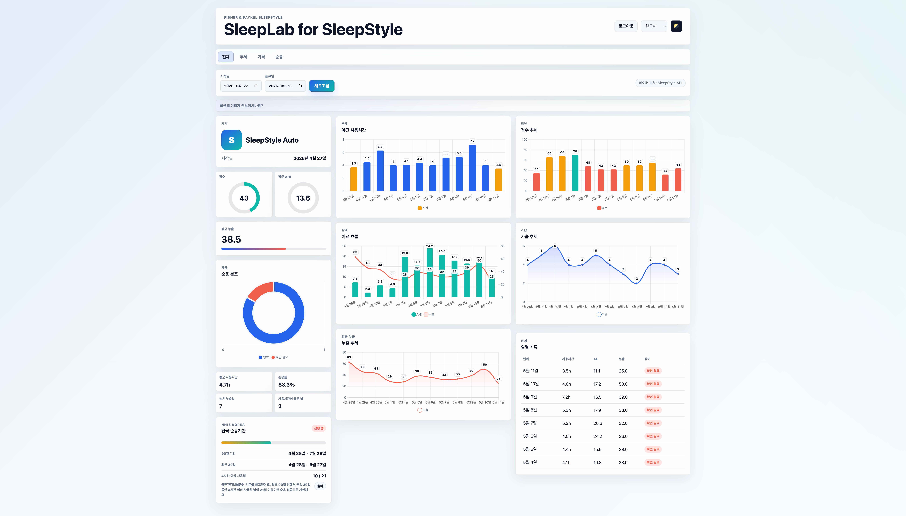

# SleepLab for SleepStyle



Fisher & Paykel SleepStyle 치료 데이터를 확인하기 위한 로컬 분석 대시보드입니다.

운영 사이트: [https://sleepstyle.maxjang.com](https://sleepstyle.maxjang.com)

Java 17, Spring Boot, Gradle, Thymeleaf, Chart.js로 만들었습니다. 공식 SleepStyle 로그인 흐름으로 로그인한 뒤 AHI, 누출, 가습, 사용시간, 순응률, 한국 국민건강보험공단 순응기간 진행 상태를 보여줍니다.

## 기능

- 공식 SleepStyle 로그인 흐름 사용
- 직접 붙여넣는 bearer 토큰 없음
- 개요, 추세, 기록, 순응 섹션
- 일별 치료 요약과 추세 그래프
- 한국 국민건강보험공단 순응기간 보조 카드
- 라이트모드와 다크모드
- 영어, 한국어, 일본어, 중국어 UI
- 이메일만 저장하는 선택 기능
- 빌드 결과 이름: `sleepstyle-dashboard.jar`

## 요구사항

- Java 17
- 유효한 SleepStyle 계정
- Fisher & Paykel SleepStyle 서비스에 접속 가능한 네트워크

## 실행

```bash
./gradlew bootRun
```

브라우저에서 아래 주소를 엽니다.

[http://localhost:8080/auth/login](http://localhost:8080/auth/login)

## 빌드

```bash
./gradlew clean bootJar
```

결과 파일:

```text
build/libs/sleepstyle-dashboard.jar
```

실행:

```bash
java -jar build/libs/sleepstyle-dashboard.jar
```

## 설정

대부분의 SleepStyle API 값은 로그인 후 공식 SleepStyle 화면에서 자동으로 가져옵니다.

선택 설정:

```bash
export SLEEPSTYLE_UTC_OFFSET="9"
```

애플리케이션 설정은 `src/main/resources/application.yml`에 있습니다. 다국어 파일은 Spring 표준 메시지 번들 형식인 `.properties`를 사용합니다.

## 한국 순응기간 보조 계산

대시보드에는 국민건강보험공단 공개 기준을 참고한 순응기간 보조 카드가 있습니다. 최초 90일 중 연속 30일 구간에서 4시간 이상 사용한 날이 21일 이상이면 순응 성공으로 계산합니다.

출처: [국민건강보험공단 양압기치료 서비스 Q&A PDF](https://www.nhis.or.kr/static/html/wbma/c/wbmac0228_9.pdf)

이 계산은 SleepStyle에서 가져온 데이터를 기준으로 한 보조 계산일 뿐이며, 국민건강보험공단의 공식 판정이 아닙니다.

## 개인정보와 보안

- 비밀번호는 이 로컬 Spring Boot 앱을 통해 공식 SleepStyle 로그인 엔드포인트로 전송됩니다
- 이 앱은 비밀번호를 저장하지 않습니다
- SleepStyle 세션 정보는 서버 HTTP 세션에 보관됩니다
- "이메일 저장"은 브라우저에 이메일 주소만 저장합니다
- CSRF 보호, no-store 응답, SameSite 세션 쿠키, 기본 브라우저 보안 헤더를 적용합니다

이 앱은 개인 로컬 사용을 전제로 합니다. 외부에 공개하려면 별도 인증, HTTPS, 배포 보안 강화, 로그 정책, 의존성 취약점 점검을 반드시 추가해야 합니다.

## 의료정보와 책임

이 프로젝트는 개인용 대시보드 뷰어입니다. 의료기기, 진단 도구, 치료 지침, 전문 의료진의 판단을 대체하는 도구가 아닙니다.

이 앱에 표시되는 모든 의료정보와 치료 데이터는 Fisher & Paykel SleepStyle 서비스에서 가져옵니다. 이 앱은 데이터를 직접 측정, 검증, 수정, 인증하거나 의학적으로 해석하지 않습니다.

이 프로젝트는 있는 그대로 제공됩니다. 작성자와 관리자는 데이터 정확성, 누락된 데이터, API 변경, 서비스 중단, 의학적 해석, 치료 판단, 기기 설정, 이 대시보드 사용으로 발생한 어떤 결과에 대해서도 책임지지 않습니다.

앱 사용, 데이터 해석, 그에 따른 모든 판단과 행동은 전적으로 사용자 책임입니다. 의료 관련 질문이 있거나 데이터가 예상과 다르면 공식 SleepStyle 서비스를 확인하고 자격 있는 의료진에게 문의하세요.

## 관계

이 프로젝트는 독립 프로젝트입니다. Fisher & Paykel Healthcare, Fisher & Paykel, F&P, SleepStyle, 국민건강보험공단과 제휴, 보증, 인증, 지원 관계가 아닙니다.
